# C4 Диаграмма уровня компонентов

## Описание

Диаграмма уровня компонентов показывает внутреннюю структуру ключевых микросервисов системы. На этом уровне детализируются основные компоненты сервисов: Auth Service, Parking Service, Booking Service и Payment Service.

## Компоненты сервисов

### Auth Service
- **AuthController** - REST API контроллер для аутентификации и авторизации
- **JwtTokenService** - генерация и валидация JWT токенов
- **UserRepository** - работа с данными пользователей в БД
- **RoleService** - управление ролями и правами доступа

### Parking Service
- **ParkingController** - REST API контроллер для управления парковками
- **ParkingRepository** - работа с данными парковок в БД
- **GoogleMapsClient** - клиент для интеграции с Google Maps API
- **CacheService** - сервис кэширования данных в Redis
- **ParkingAvailabilityService** - управление доступностью парковочных мест

### Booking Service
- **BookingController** - REST API контроллер для управления бронированиями
- **BookingRepository** - работа с данными бронирований в БД
- **BookingService** - бизнес-логика создания и управления бронированиями
- **EventPublisher** - публикация событий в RabbitMQ

### Payment Service
- **PaymentController** - REST API контроллер для обработки платежей
- **PaymentRepository** - работа с данными платежей в БД
- **MonetaClient** - клиент для интеграции с платежным шлюзом Монета.ру
- **PaymentProcessor** - бизнес-логика обработки платежей
- **EventPublisher** - публикация событий в RabbitMQ

## Диаграмма

```mermaid
C4Component
    title Диаграмма уровня компонентов - Ключевые сервисы

    Container_Boundary(authService, "Auth Service") {
        Component(authController, "AuthController", ".NET Controller", "REST API для аутентификации и авторизации")
        Component(jwtService, "JwtTokenService", ".NET Service", "Генерация и валидация JWT токенов")
        Component(userRepo, "UserRepository", ".NET Repository", "Работа с данными пользователей")
        Component(roleService, "RoleService", ".NET Service", "Управление ролями и правами доступа")
        
        Rel(authController, jwtService, "Использует")
        Rel(authController, userRepo, "Использует")
        Rel(authController, roleService, "Использует")
        Rel(roleService, userRepo, "Использует")
    }

    Container_Boundary(parkingService, "Parking Service") {
        Component(parkingController, "ParkingController", ".NET Controller", "REST API для управления парковками")
        Component(parkingRepo, "ParkingRepository", ".NET Repository", "Работа с данными парковок")
        Component(googleMapsClient, "GoogleMapsClient", ".NET Client", "Интеграция с Google Maps API")
        Component(cacheService, "CacheService", ".NET Service", "Кэширование данных в Redis")
        Component(availabilityService, "ParkingAvailabilityService", ".NET Service", "Управление доступностью парковочных мест")
        
        Rel(parkingController, parkingRepo, "Использует")
        Rel(parkingController, cacheService, "Использует")
        Rel(parkingController, availabilityService, "Использует")
        Rel(availabilityService, parkingRepo, "Использует")
        Rel(availabilityService, cacheService, "Использует")
        Rel(availabilityService, googleMapsClient, "Использует")
    }

    Container_Boundary(bookingService, "Booking Service") {
        Component(bookingController, "BookingController", ".NET Controller", "REST API для управления бронированиями")
        Component(bookingRepo, "BookingRepository", ".NET Repository", "Работа с данными бронирований")
        Component(bookingLogic, "BookingService", ".NET Service", "Бизнес-логика создания и управления бронированиями")
        Component(bookingEventPub, "EventPublisher", ".NET Service", "Публикация событий в RabbitMQ")
        
        Rel(bookingController, bookingLogic, "Использует")
        Rel(bookingLogic, bookingRepo, "Использует")
        Rel(bookingLogic, bookingEventPub, "Использует")
    }

    Container_Boundary(paymentService, "Payment Service") {
        Component(paymentController, "PaymentController", ".NET Controller", "REST API для обработки платежей")
        Component(paymentRepo, "PaymentRepository", ".NET Repository", "Работа с данными платежей")
        Component(monetaClient, "MonetaClient", ".NET Client", "Интеграция с платежным шлюзом Монета.ру")
        Component(paymentProcessor, "PaymentProcessor", ".NET Service", "Бизнес-логика обработки платежей")
        Component(paymentEventPub, "EventPublisher", ".NET Service", "Публикация событий в RabbitMQ")
        
        Rel(paymentController, paymentProcessor, "Использует")
        Rel(paymentProcessor, paymentRepo, "Использует")
        Rel(paymentProcessor, monetaClient, "Использует")
        Rel(paymentProcessor, paymentEventPub, "Использует")
    }

    ContainerDb(postgres, "PostgreSQL", "Основная БД")
    ContainerDb(redis, "Redis", "Кэш")
    ContainerQueue(rabbitmq, "RabbitMQ", "Брокер сообщений")
    System_Ext(googleMaps, "Google Maps API")
    System_Ext(moneta, "Монета.ру")

    Rel(userRepo, postgres, "Читает и записывает", "SQL")
    Rel(parkingRepo, postgres, "Читает и записывает", "SQL")
    Rel(cacheService, redis, "Кэширует данные", "Redis Protocol")
    Rel(googleMapsClient, googleMaps, "Получает данные", "HTTPS")
    Rel(bookingRepo, postgres, "Читает и записывает", "SQL")
    Rel(bookingEventPub, rabbitmq, "Публикует события", "AMQP")
    Rel(paymentRepo, postgres, "Читает и записывает", "SQL")
    Rel(monetaClient, moneta, "Обрабатывает платежи", "HTTPS")
    Rel(paymentEventPub, rabbitmq, "Публикует события", "AMQP")
```

