# C4 Диаграмма уровня контейнеров

## Описание

Диаграмма уровня контейнеров показывает все микросервисы, клиентские приложения и инфраструктурные компоненты системы. На этом уровне отображается архитектура системы с точки зрения развертываемых контейнеров и их взаимодействия.

## Компоненты системы

### Клиентские приложения
- **React SPA** - веб-приложение для пользователей и администраторов

### API Gateway
- **Nginx** - API Gateway и балансировщик нагрузки, маршрутизирует запросы к микросервисам

### Микросервисы (.NET)
- **Auth Service** - аутентификация, авторизация, JWT токены, управление ролями
- **Parking Service** - управление парковками и местами, интеграция с Google Maps, кэширование в Redis
- **Booking Service** - создание и управление бронированиями парковочных мест
- **Payment Service** - интеграция с Монета.ру, обработка платежей
- **Notification Service** - email и push уведомления через RabbitMQ
- **Admin Service** - управление провайдерами, тарифами, статистика
- **Chat Service** - WebSocket чат для администраторов и операторов

### Инфраструктура
- **PostgreSQL** - основная БД с схемами: auth, parking, booking, payment, admin, chat
- **Redis** - кэширование и состояние парковочных мест в реальном времени
- **RabbitMQ** - брокер сообщений для асинхронного взаимодействия между сервисами

### Внешние системы
- **Google Maps API** - картографические данные и геолокация
- **Монета.ру** - платежный шлюз

## Диаграмма

```mermaid
C4Container
    title Диаграмма уровня контейнеров - Сервис Парковки

    Person(driver, "Водитель")
    Person(admin, "Администратор парковки")
    Person(operator, "Оператор системы")

    System_Boundary(parkingSystem, "Сервис Парковки") {
        Container(spa, "React SPA", "JavaScript, React", "Веб-приложение для пользователей и администраторов")
        Container(nginx, "Nginx", "Nginx", "API Gateway и балансировщик нагрузки")
        
        Container(authService, "Auth Service", ".NET", "Аутентификация, авторизация, JWT токены, роли")
        Container(parkingService, "Parking Service", ".NET", "Управление парковками и местами, интеграция с Google Maps")
        Container(bookingService, "Booking Service", ".NET", "Создание и управление бронированиями")
        Container(paymentService, "Payment Service", ".NET", "Интеграция с Монета.ру, обработка платежей")
        Container(notificationService, "Notification Service", ".NET", "Email и push уведомления")
        Container(adminService, "Admin Service", ".NET", "Управление провайдерами, тарифами, статистика")
        Container(chatService, "Chat Service", ".NET", "WebSocket чат для администраторов и операторов")
        
        ContainerDb(postgres, "PostgreSQL", "PostgreSQL", "Основная БД (схемы: auth, parking, booking, payment, admin, chat)")
        ContainerDb(redis, "Redis", "Redis", "Кэширование и состояние парковочных мест в реальном времени")
        ContainerQueue(rabbitmq, "RabbitMQ", "RabbitMQ", "Брокер сообщений для асинхронного взаимодействия")
    }

    System_Ext(googleMaps, "Google Maps API", "Внешний сервис картографических данных")
    System_Ext(moneta, "Монета.ру", "Внешний платежный шлюз")

    Rel(driver, spa, "Использует", "HTTPS")
    Rel(admin, spa, "Использует", "HTTPS")
    Rel(operator, spa, "Использует", "HTTPS")

    Rel(spa, nginx, "API запросы", "HTTPS")
    Rel(spa, chatService, "WebSocket соединение", "WSS")

    Rel(nginx, authService, "Маршрутизация", "HTTP")
    Rel(nginx, parkingService, "Маршрутизация", "HTTP")
    Rel(nginx, bookingService, "Маршрутизация", "HTTP")
    Rel(nginx, paymentService, "Маршрутизация", "HTTP")
    Rel(nginx, adminService, "Маршрутизация", "HTTP")

    Rel(authService, postgres, "Читает и записывает", "SQL")
    Rel(parkingService, postgres, "Читает и записывает", "SQL")
    Rel(parkingService, redis, "Кэширует данные", "Redis Protocol")
    Rel(parkingService, googleMaps, "Получает картографические данные", "HTTPS")
    Rel(bookingService, postgres, "Читает и записывает", "SQL")
    Rel(bookingService, rabbitmq, "Публикует события", "AMQP")
    Rel(paymentService, postgres, "Читает и записывает", "SQL")
    Rel(paymentService, moneta, "Обрабатывает платежи", "HTTPS")
    Rel(paymentService, rabbitmq, "Публикует события", "AMQP")
    Rel(notificationService, rabbitmq, "Подписывается на события", "AMQP")
    Rel(notificationService, postgres, "Читает и записывает", "SQL")
    Rel(adminService, postgres, "Читает и записывает", "SQL")
    Rel(chatService, postgres, "Читает и записывает", "SQL")
```

