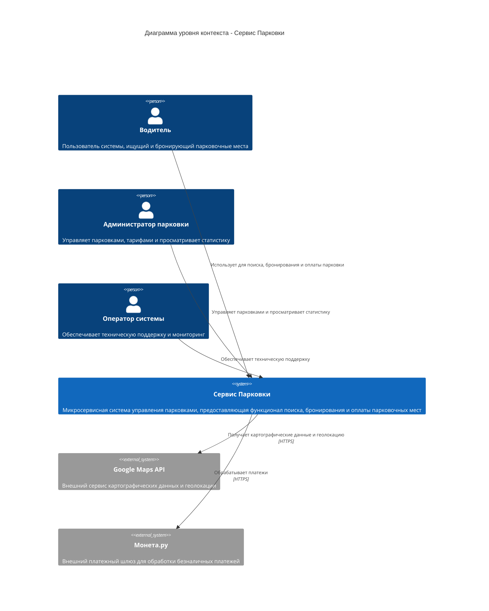

# C4 Диаграмма уровня контекста

## Описание

Диаграмма уровня контекста показывает систему "Сервис Парковки" в целом и её взаимодействие с внешними актерами и системами. На этом уровне отображаются основные пользователи системы и внешние интеграции.

## Актеры

- **Водитель** - основной пользователь системы, который ищет парковочные места, бронирует их и оплачивает парковку
- **Администратор парковки** - управляет парковками, тарифами, просматривает статистику
- **Оператор системы** - обеспечивает техническую поддержку и мониторинг системы

## Внешние системы

- **Google Maps API** - предоставляет картографические данные и геолокацию
- **Монета.ру** - платежный шлюз для обработки безналичных платежей

## Диаграмма

